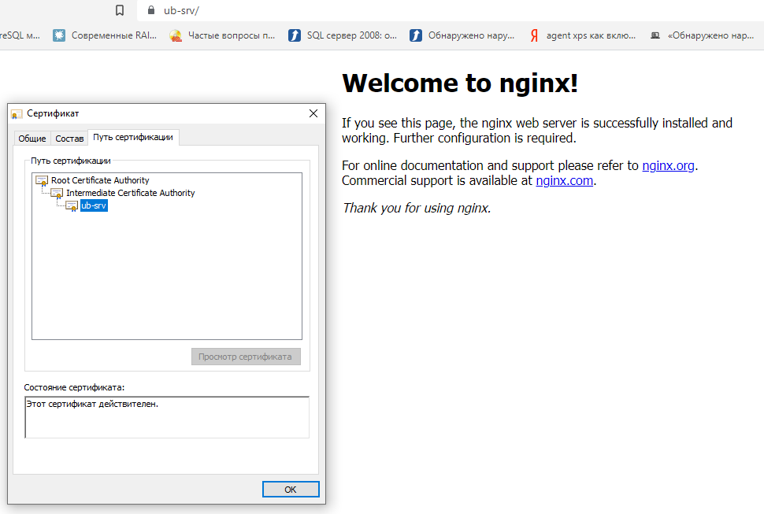
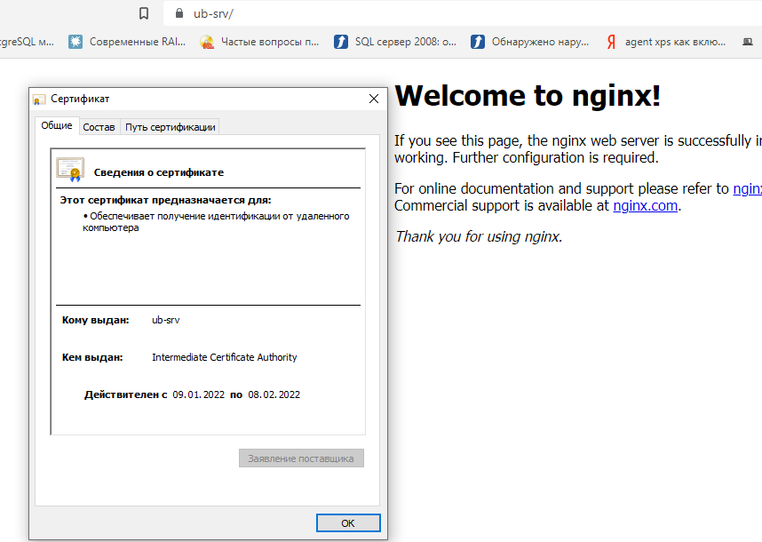

1. Создайте виртуальную машину Linux.
2. Установите ufw и разрешите к этой машине сессии на порты 22 и 443, при этом трафик на интерфейсе localhost (lo) должен 
ходить свободно на все порты.
3. Установите hashicorp vault (инструкция по ссылке).
4. Cоздайте центр сертификации по инструкции (ссылка) и выпустите сертификат для использования его в настройке веб-сервера 
nginx (срок жизни сертификата - месяц).
5. Установите корневой сертификат созданного центра сертификации в доверенные в хостовой системе.
6. Установите nginx.
7. По инструкции (ссылка) настройте nginx на https, используя ранее подготовленный сертификат:
можно использовать стандартную стартовую страницу nginx для демонстрации работы сервера;
можно использовать и другой html файл, сделанный вами;
8. Откройте в браузере на хосте https адрес страницы, которую обслуживает сервер nginx.
9. Создайте скрипт, который будет генерировать новый сертификат в vault:
генерируем новый сертификат так, чтобы не переписывать конфиг nginx;
перезапускаем nginx для применения нового сертификата.
10. Поместите скрипт в crontab, чтобы сертификат обновлялся какого-то числа каждого месяца в удобное для вас время.

***Ответ:***
2.
```commandline
ufw default deny incoming
ufw default allow outgoing
ufw allow 22
ufw allow 443
root@ub-srv:/home/user# ufw status
Status: active

To                         Action      From
--                         ------      ----
22                         ALLOW       Anywhere
443                        ALLOW       Anywhere
22 (v6)                    ALLOW       Anywhere (v6)
443 (v6)                   ALLOW       Anywhere (v6)
```
3-4.
```commandline
curl -fsSL https://apt.releases.hashicorp.com/gpg | sudo apt-key add -
apt-add-repository "deb [arch=amd64] https://apt.releases.hashicorp.com $(lsb_release -cs) main"
apt-get update && sudo apt-get install vault&
systemctl enable vault --now
./tst.sh
```
```shell tst.sh
#!/bin/bash

ca_street="road"
ca_org="org"
ca_ou="IT"
ca_url="https://127.0.0.1:8200"

# enable Vault PKI secret
vault secrets enable \
  -path=pki_root_ca \
  -description="PKI Root CA" \
  -max-lease-ttl="262800h" \
  pki

# generate root CA
vault write -format=json pki_root_ca/root/generate/internal \
  common_name="Root Certificate Authority" \
  country="Russian Federation" \
  locality="EKB" \
  street_address="$ca_street" \
  postal_code="1" \
  organization="$ca_org" \
  ou="$ca_ou" \
  ttl="262800h" > pki-root-ca.json

# save the certificate
cat pki-root-ca.json | jq -r .data.certificate > rootCA.pem

# publish urls for the root ca
vault write pki_root_ca/config/urls \
  issuing_certificates="$ca_url/v1/pki_root_ca/ca" \
  crl_distribution_points="$ca_url/v1/pki_root_ca/crl"

# enable Vault PKI secret
vault secrets enable \
  -path=pki_int_ca \
  -description="PKI Intermediate CA" \
  -max-lease-ttl="175200h" \
  pki

# create intermediate CA with common name example.com and save the CSR
vault write -format=json pki_int_ca/intermediate/generate/internal \
  common_name="Intermediate Certificate Authority" \
  country="Russian Federation" \
  locality="EKB" \
  street_address="$ca_street" \
  postal_code="1" \
  organization="$ca_org" \
  ou="$ca_ou" \
  ttl="175200h" | jq -r '.data.csr' > pki_intermediate_ca.csr

# send the intermediate CA's CSR to the root CA
vault write -format=json pki_root_ca/root/sign-intermediate csr=@pki_intermediate_ca.csr \
  country="Russia Federation" \
  locality="EKB" \
  street_address="$ca_street" \
  postal_code="1" \
  organization="$ca_org" \
  ou="$ca_ou" \
  format=pem_bundle \
  ttl="175200h" | jq -r '.data.certificate' > intermediateCA.cert.pem

# publish the signed certificate back to the Intermediate CA
vault write pki_int_ca/intermediate/set-signed \
  certificate=@intermediateCA.cert.pem

# publish the intermediate CA urls ???
vault write pki_int_ca/config/urls \
  issuing_certificates="$ca_url/v1/pki_int_ca/ca" \
  crl_distribution_points="$ca_url/v1/pki_int_ca/crl"

# create a role example-dot-com-server
vault write pki_int_ca/roles/ub-srv-server \
  country="Russia Federation" \
  locality="EKB" \
  street_address="$ca_street" \
  postal_code="1" \
  organization="$ca_org" \
  ou="$ca_ou" \
  allowed_domains="ub-srv" \
  allow_subdomains=true \
  max_ttl="87600h" \
  key_bits="2048" \
  key_type="rsa" \
  allow_any_name=true \
  allow_bare_domains=false \
  allow_glob_domain=false \
  allow_ip_sans=true \
  allow_localhost=false \
  client_flag=false \
  server_flag=true \
  enforce_hostnames=true \
  key_usage="DigitalSignature,KeyEncipherment" \
  ext_key_usage="ServerAuth" \
  require_cn=true

# create a role example-dot-com-client
vault write pki_int_ca/roles/ub-srv-client \
  country="Russia Federation" \
  locality="EKB" \
  street_address="$ca_street" \
  postal_code="1" \
  organization="$ca_org" \
  ou="$ca_ou" \
  allow_subdomains=true \
  max_ttl="87600h" \
  key_bits="2048" \
  key_type="rsa" \
  allow_any_name=true \
  allow_bare_domains=false \
  allow_glob_domain=false \
  allow_ip_sans=false \
  allow_localhost=false \
  client_flag=true \
  server_flag=false \
  enforce_hostnames=false \
  key_usage="DigitalSignature" \
  ext_key_usage="ClientAuth" \
  require_cn=true

# Create cert, 5 years
vault write -format=json pki_int_ca/issue/ub-srv-server \
  common_name="ub-srv" \
  alt_names="ub-srv.local" \
  ttl="720h" > ub-srv.crt

# save cert
cat ub-srv.crt | jq -r .data.certificate > vault.ub-srv.pem
cat ub-srv.crt | jq -r .data.issuing_ca >> vault.ub-srv.pem
cat ub-srv.crt | jq -r .data.private_key > vault.ub-srv.key
```

5. 

6. apt-get install nginx
7. nano /etc/nginx/ssl.conf
```commandline
  ssl on;
  ssl_protocols SSLv3 TLSv1.2;
  ssl_certificate /opt/vault/tls/vault.ub-srv.pem;
  ssl_certificate_key /opt/vault/tls/vault.ub-srv.key;
```

8. 

9. nano /opt/vault.sh
```commandline
#!/bin/bash

vault write -format=json pki_int_ca/issue/ub-srv-server \
  common_name="ub-srv" \
  alt_names="ub-srv.local" \
  ttl="720h" > ub-srv.crt

cat ub-srv.crt | jq -r .data.certificate > /opt/vault/tls/vault.ub-srv.pem
cat ub-srv.crt | jq -r .data.issuing_ca >> /opt/vault/tls/vault.ub-srv.pem
cat ub-srv.crt | jq -r .data.private_key > /opt/vault/tls/vault.ub-srv.key

sleep 5

systemctl restart nginx
```

10. crontab -e
```commandline
# m h  dom mon dow   command

0 0 1 * * /opt/vault.sh
```