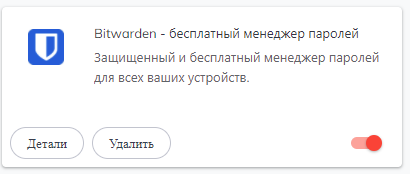
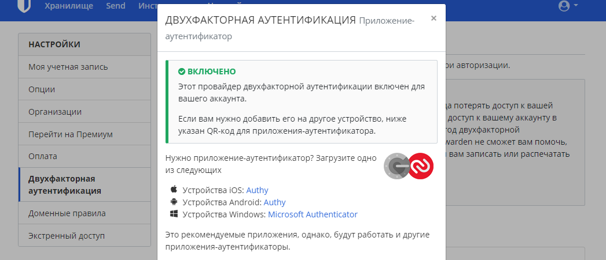
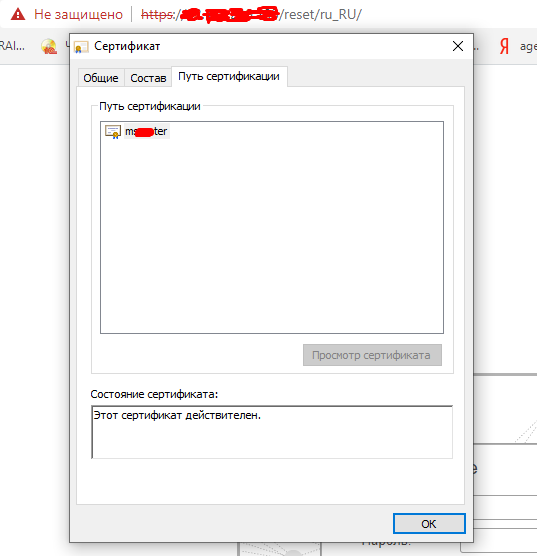
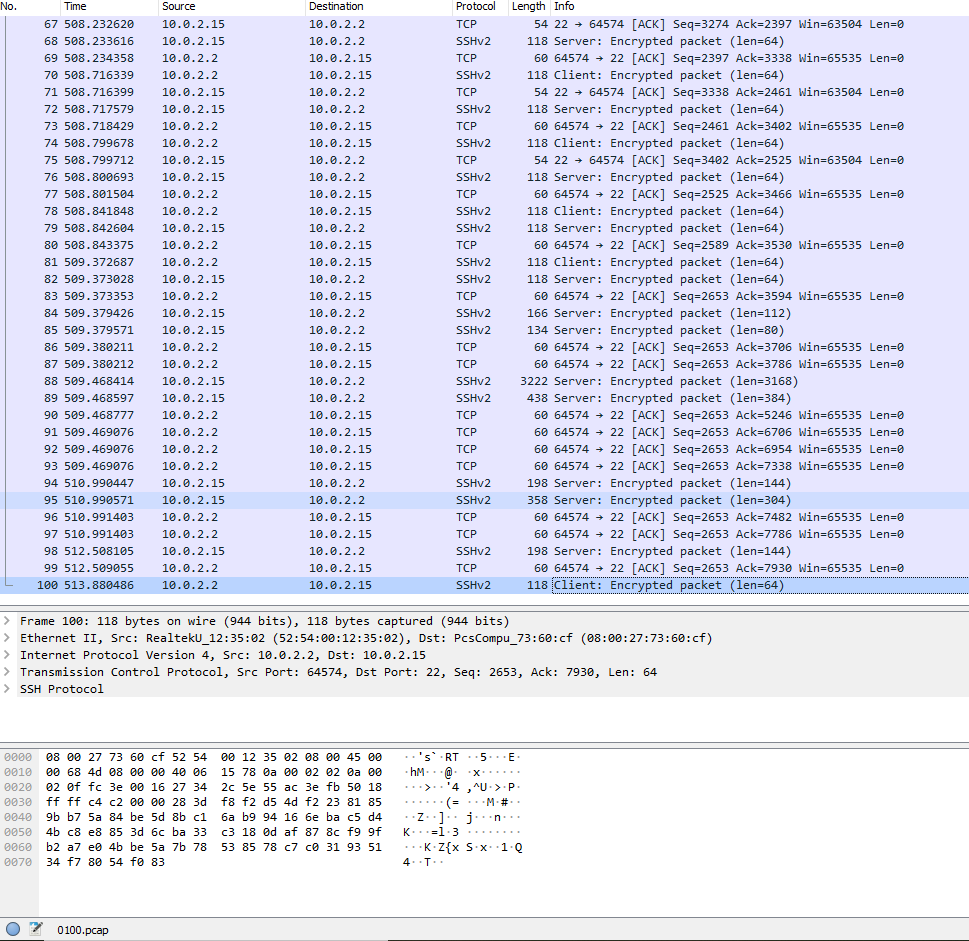

1.Установите Bitwarden плагин для браузера. Зарегестрируйтесь и сохраните несколько паролей.
***Ответ***


2. Установите Google authenticator на мобильный телефон. Настройте вход в Bitwarden акаунт через Google authenticator OTP.
***Ответ***


3. Установите apache2, сгенерируйте самоподписанный сертификат, настройте тестовый сайт для работы по HTTPS
***Ответ***
Из продуктива с работы. База 1с на https.


4. Проверьте на TLS уязвимости произвольный сайт в интернете.
***Ответ***
````root@vagrant:/home/vagrant/testssl.sh# ./testssl.sh -e --fast --parallel https://www.youtube.com

###########################################################
    testssl.sh       3.1dev from https://testssl.sh/dev/
    (2dce751 2021-12-09 17:03:57 -- )

      This program is free software. Distribution and
             modification under GPLv2 permitted.
      USAGE w/o ANY WARRANTY. USE IT AT YOUR OWN RISK!

       Please file bugs @ https://testssl.sh/bugs/

###########################################################

 Using "OpenSSL 1.0.2-chacha (1.0.2k-dev)" [~183 ciphers]
 on vagrant:./bin/openssl.Linux.x86_64
 (built: "Jan 18 17:12:17 2019", platform: "linux-x86_64")


 Start 2021-12-10 11:58:43        -->> 74.125.131.198:443 (www.youtube.com) <<--

 Further IP addresses:   2a00:1450:4010:c1e::c6
 rDNS (74.125.131.198):  lu-in-f198.1e100.net.
 Service detected:       HTTP


 Testing all 183 locally available ciphers against the server, ordered by encryption strength


Hexcode  Cipher Suite Name (OpenSSL)       KeyExch.   Encryption  Bits     Cipher Suite Name (IANA/RFC)
-----------------------------------------------------------------------------------------------------------------------------
 xc030   ECDHE-RSA-AES256-GCM-SHA384       ECDH 256   AESGCM      256      TLS_ECDHE_RSA_WITH_AES_256_GCM_SHA384

 xc02c   ECDHE-ECDSA-AES256-GCM-SHA384     ECDH 256   AESGCM      256      TLS_ECDHE_ECDSA_WITH_AES_256_GCM_SHA384

 xc014   ECDHE-RSA-AES256-SHA              ECDH 256   AES         256      TLS_ECDHE_RSA_WITH_AES_256_CBC_SHA

 xc00a   ECDHE-ECDSA-AES256-SHA            ECDH 256   AES         256      TLS_ECDHE_ECDSA_WITH_AES_256_CBC_SHA

 x9d     AES256-GCM-SHA384                 RSA        AESGCM      256      TLS_RSA_WITH_AES_256_GCM_SHA384

 x35     AES256-SHA                        RSA        AES         256      TLS_RSA_WITH_AES_256_CBC_SHA

 xc02f   ECDHE-RSA-AES128-GCM-SHA256       ECDH 256   AESGCM      128      TLS_ECDHE_RSA_WITH_AES_128_GCM_SHA256

 xc02b   ECDHE-ECDSA-AES128-GCM-SHA256     ECDH 256   AESGCM      128      TLS_ECDHE_ECDSA_WITH_AES_128_GCM_SHA256

 xc013   ECDHE-RSA-AES128-SHA              ECDH 256   AES         128      TLS_ECDHE_RSA_WITH_AES_128_CBC_SHA

 xc009   ECDHE-ECDSA-AES128-SHA            ECDH 256   AES         128      TLS_ECDHE_ECDSA_WITH_AES_128_CBC_SHA
root@vagrant:/home/vagrant/testssl.sh#
 x9c     AES128-GCM-SHA256                 RSA        AESGCM      128      TLS_RSA_WITH_AES_128_GCM_SHA256

 x2f     AES128-SHA                        RSA        AES         128      TLS_RSA_WITH_AES_128_CBC_SHA

 x0a     DES-CBC3-SHA                      RSA        3DES        168      TLS_RSA_WITH_3DES_EDE_CBC_SHA


 Done 2021-12-10 11:58:52 [  12s] -->> 74.125.131.198:443 (www.youtube.com) <<--commandline
````

5. Установите на Ubuntu ssh сервер, сгенерируйте новый приватный ключ. Скопируйте свой публичный ключ на другой сервер. 
Подключитесь к серверу по SSH-ключу.
***Ответ***
```commandline
root@vagrant:/home/vagrant# apt install openssh-server
root@vagrant:/home/vagrant# systemctl start sshd.service
root@vagrant:/home/vagrant# ssh-keygen
Generating public/private rsa key pair.
Enter file in which to save the key (/root/.ssh/id_rsa): test
Enter passphrase (empty for no passphrase):
Enter same passphrase again:
Your identification has been saved in test
Your public key has been saved in test.pub
The key fingerprint is:
SHA256:DUXiZQW+ureXkgfO8AsM5isyn2v3pN0GY6Yy2QQ3LsY root@vagrant
The key's randomart image is:
+---[RSA 3072]----+
|        ..*o.    |
|       . *       |
|        o .      |
|    . o  o .     |
|   . +o.S o      |
|    Eooo*..      |
|   . =.+=B o .   |
|  o *.+= +O +    |
|   =+*o.+o+*     |
+----[SHA256]-----+
root@vagrant:/home/vagrant# echo public_key_string >> /home/vagrant/.ssh/authorized_keys
ssh -i /home/vagrant/test.pub admin1c@10.8.0.1
The authenticity of host '10.8.0.1 (10.8.0.1)' can't be established.
ECDSA key fingerprint is SHA256:S2wL9FR97lln/ouXFAQdmMRtBeoRuDpiwZ5kTYzPh6k.
Are you sure you want to continue connecting (yes/no/[fingerprint])?
```

6. Переименуйте файлы ключей из задания 5. Настройте файл конфигурации SSH клиента, так чтобы вход на удаленный 
сервер осуществлялся по имени сервера.
7. Соберите дамп трафика утилитой tcpdump в формате pcap, 100 пакетов. Откройте файл pcap в Wireshark.
***Ответ***
```root@vagrant:~# tcpdump -c 100 -w 0100.pcap```
