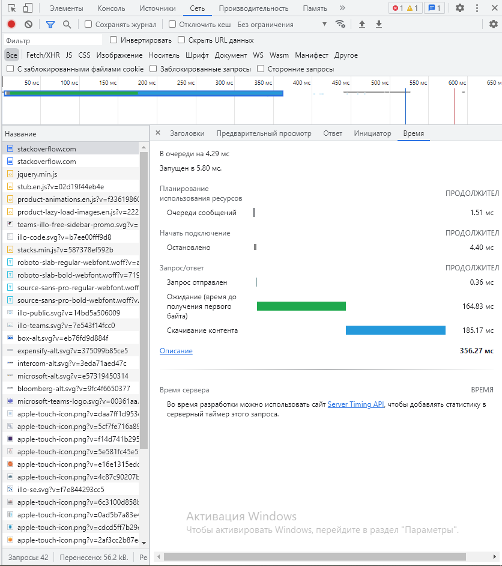

1. Работа c HTTP через телнет.
Подключитесь утилитой телнет к сайту stackoverflow.com telnet stackoverflow.com 80
отправьте HTTP запрос
```
GET /questions HTTP/1.0
HOST: stackoverflow.com
[press enter]
[press enter]
```
В ответе укажите полученный HTTP код, что он означает?
***Ответ***
```
telnet> open stackoverflow.com 80
Trying 151.101.1.69...
Connected to stackoverflow.com.
Escape character is '^]'.
GET /questions HTTP/1.0
HOST: stackoverflow.com

HTTP/1.1 301 Moved Permanently
cache-control: no-cache, no-store, must-revalidate
location: https://stackoverflow.com/questions
x-request-guid: 17b60bd3-3e3c-4382-ac70-526e4e4ecc2a
feature-policy: microphone 'none'; speaker 'none'
content-security-policy: upgrade-insecure-requests; frame-ancestors 'self' https://stackexchange.com
Accept-Ranges: bytes
Date: Wed, 01 Dec 2021 08:11:51 GMT
Via: 1.1 varnish
Connection: close
X-Served-By: cache-fra19168-FRA
X-Cache: MISS
X-Cache-Hits: 0
X-Timer: S1638346311.421458,VS0,VE92
Vary: Fastly-SSL
X-DNS-Prefetch-Control: off
Set-Cookie: prov=d6c9c845-4323-ad1d-7d1f-21293b6074cd; domain=.stackoverflow.com; expires=Fri, 01-Jan-2055 00:00:00 GMT; path=/; HttpOnly
```
301 код означает, что ресурс был перемещен. location означает место куда ресурс переехал.

2. Повторите задание 1 в браузере, используя консоль разработчика F12.
откройте вкладку Network
отправьте запрос http://stackoverflow.com
найдите первый ответ HTTP сервера, откройте вкладку Headers
укажите в ответе полученный HTTP код.
проверьте время загрузки страницы, какой запрос обрабатывался дольше всего?
приложите скриншот консоли браузера в ответ.
***Ответ***
```
Запросить URL: https://stackoverflow.com/
Метод запроса: GET
Код статуса: 200 
Удаленный адрес: 151.101.1.69:443
Правило для URL перехода: strict-origin-when-cross-origin
accept-ranges: bytes
cache-control: private
content-encoding: gzip
Content-Security-Policy: upgrade-insecure-requests; frame-ancestors 'self' https://stackexchange.com
content-type: text/html; charset=utf-8
date: Thu, 02 Dec 2021 08:56:56 GMT
feature-policy: microphone 'none'; speaker 'none'
strict-transport-security: max-age=15552000
vary: Accept-Encoding,Fastly-SSL
via: 1.1 varnish
x-cache: MISS
x-cache-hits: 0
x-dns-prefetch-control: off
x-frame-options: SAMEORIGIN
x-request-guid: 600fc1cc-f1eb-4545-9d3c-b8d94e3b8266
x-served-by: cache-fra19157-FRA
x-timer: S1638435416.309379,VS0,VE95
```


3. Какой IP адрес у вас в интернете?
***Ответ***
```
root@vagrant:/home/vagrant# wget -qO- ident.me
46.48.88.111
```

4. Какому провайдеру принадлежит ваш IP адрес? Какой автономной системе AS? Воспользуйтесь утилитой whois
***Ответ***
```
root@vagrant:/home/vagrant# whois 46.48.88.111
org-name:       LLC "KomTehCentr"
origin:         AS12668
```

5. Через какие сети проходит пакет, отправленный с вашего компьютера на адрес 8.8.8.8? Через какие AS?  
Воспользуйтесь утилитой traceroute
***Ответ***
```
traceroute -A -M icmp 8.8.8.8
6. root@vagrant:/home/vagrant# traceroute -A -M icmp 8.8.8.8
traceroute to 8.8.8.8 (8.8.8.8), 30 hops max, 60 byte packets
 1  _gateway (10.0.2.2) [*]  0.405 ms  0.372 ms  0.363 ms
 2  192.168.0.1 (192.168.0.1) [*]  2.465 ms  2.457 ms  2.450 ms
 3  vl1365.ar04-25.ekb.ru.mirasystem.net (46.48.88.111) [AS12666]  2.755 ms  3.062 ms  4.803 ms
 4  be5-4031.sr36-27.ekb.ru.mirasystem.net (92.242.30.102) [AS12666]  4.789 ms  4.951 ms  5.020 ms
 5  be5-4031.sr36-27.ekb.ru.mirasystem.net (92.242.30.102) [AS12666]  4.948 ms  5.064 ms  5.299 ms
 6  212.188.22.34 (212.188.22.34) [AS8359]  8.482 ms  7.011 ms  7.570 ms
 7  asb-cr01-ae9.200.ekt.mts-internet.net (212.188.22.33) [AS8359]  5.184 ms  9.258 ms  9.238 ms
 8  zoo-cr03-be1.66.ekt.mts-internet.net (212.188.29.249) [AS8359]  9.184 ms  8.990 ms  8.947 ms
 9  vish-cr01-be7.66.kaz.mts-internet.net (212.188.29.85) [AS8359]  22.038 ms  22.419 ms  22.366 ms
10  mag9-cr02-be6.16.msk.mts-internet.net (195.34.50.161) [AS8359]  35.979 ms  36.372 ms  35.751 ms
11  mag9-cr01-be16.77.msk.mts-internet.net (212.188.29.82) [AS8359]  36.453 ms  36.262 ms  31.859 ms
12  108.170.250.130 (108.170.250.130) [AS15169]  32.883 ms  33.589 ms  31.221 ms
13  209.85.255.136 (209.85.255.136) [AS15169]  47.854 ms  48.236 ms  48.204 ms
14  209.85.254.20 (209.85.254.20) [AS15169]  50.562 ms  50.386 ms  55.518 ms
15  142.250.56.129 (142.250.56.129) [AS15169]  47.103 ms  47.580 ms  47.475 ms
25  dns.google (8.8.8.8) [AS15169]  48.794 ms  49.197 ms *
```

6. Повторите задание 5 в утилите mtr. На каком участке наибольшая задержка - delay?
***Ответ***
На 3м хосте:
```buildoutcfg
root@vagrant:/home/vagrant# mtr 8.8.8.8
 Host                                                                        Loss%   Snt   Last   Avg  Best  Wrst StDev
 1. _gateway                                                                  0.0%   154    0.5   0.8   0.1  21.7   1.8
 2. 192.168.0.1                                                               0.0%   154    1.8   2.2   0.7  40.8   4.0
 3. vl1365.ar04-25.ekb.ru.mirasystem.net                                      0.0%   154    4.7  19.5   1.2 224.5  43.1
```
7. Какие DNS сервера отвечают за доменное имя dns.google? Какие A записи? воспользуйтесь утилитой dig
***Ответ***
```buildoutcfg
root@vagrant:/home/vagrant# dig dns.google.com

; <<>> DiG 9.16.1-Ubuntu <<>> dns.google.com
;; global options: +cmd
;; Got answer:
;; ->>HEADER<<- opcode: QUERY, status: NOERROR, id: 11189
;; flags: qr rd ra; QUERY: 1, ANSWER: 2, AUTHORITY: 0, ADDITIONAL: 1

;; OPT PSEUDOSECTION:
; EDNS: version: 0, flags:; udp: 65494
;; QUESTION SECTION:
;dns.google.com.                        IN      A

;; ANSWER SECTION:
dns.google.com.         690     IN      A       8.8.4.4
dns.google.com.         690     IN      A       8.8.8.8
```
8. Проверьте PTR записи для IP адресов из задания 7. Какое доменное имя привязано к IP? воспользуйтесь утилитой dig
***Ответ***
```buildoutcfg
root@vagrant:/home/vagrant# dig -x 8.8.8.8

; <<>> DiG 9.16.1-Ubuntu <<>> -x 8.8.8.8
;; global options: +cmd
;; Got answer:
;; ->>HEADER<<- opcode: QUERY, status: NOERROR, id: 21438
;; flags: qr rd ra; QUERY: 1, ANSWER: 1, AUTHORITY: 0, ADDITIONAL: 1

;; OPT PSEUDOSECTION:
; EDNS: version: 0, flags:; udp: 65494
;; QUESTION SECTION:
;8.8.8.8.in-addr.arpa.          IN      PTR

;; ANSWER SECTION:
8.8.8.8.in-addr.arpa.   6554    IN      PTR     dns.google.

root@vagrant:/home/vagrant# dig -x 8.8.4.4.
dig: '.4.4.8.8.in-addr.arpa.' is not a legal name (empty label)
root@vagrant:/home/vagrant# dig -x 8.8.4.4

; <<>> DiG 9.16.1-Ubuntu <<>> -x 8.8.4.4
;; global options: +cmd
;; Got answer:
;; ->>HEADER<<- opcode: QUERY, status: NOERROR, id: 8657
;; flags: qr rd ra; QUERY: 1, ANSWER: 1, AUTHORITY: 0, ADDITIONAL: 1

;; OPT PSEUDOSECTION:
; EDNS: version: 0, flags:; udp: 65494
;; QUESTION SECTION:
;4.4.8.8.in-addr.arpa.          IN      PTR

;; ANSWER SECTION:
4.4.8.8.in-addr.arpa.   9675    IN      PTR     dns.google.
```