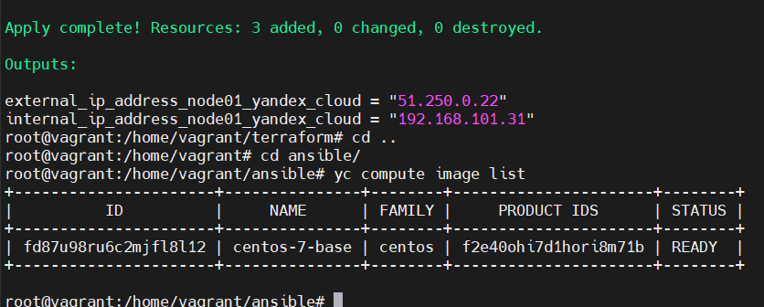
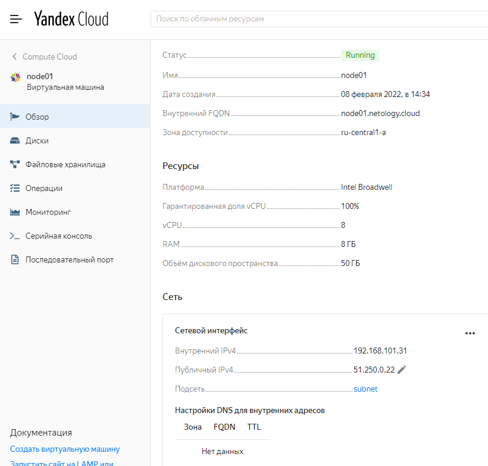
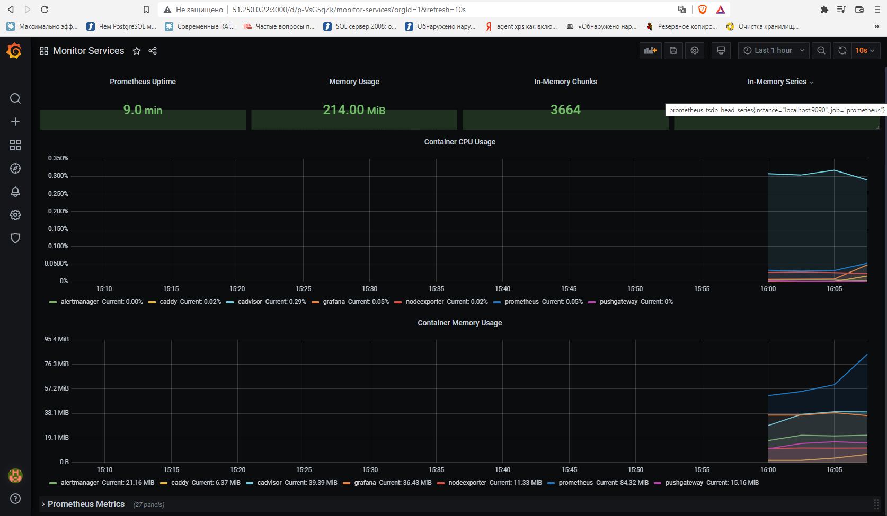

**Задача 1**
Создать собственный образ операционной системы с помощью Packer.

Для получения зачета, вам необходимо предоставить:

Скриншот страницы, как на слайде из презентации (слайд 37).

***Ответ:***

**Задача 2**
Создать вашу первую виртуальную машину в Яндекс.Облаке.

***Ответ:***

**Задача 3**
Создать ваш первый готовый к боевой эксплуатации компонент мониторинга, состоящий из стека микросервисов.

***Ответ:***

