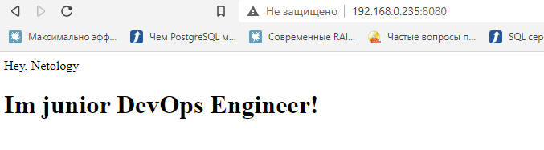

**Задача 1**
Сценарий выполения задачи:

создайте свой репозиторий на https://hub.docker.com;
выберете любой образ, который содержит веб-сервер Nginx;
создайте свой fork образа;
реализуйте функциональность: запуск веб-сервера в фоне с индекс-страницей, содержащей HTML-код ниже:
<html>
<head>
Hey, Netology
</head>
<body>
<h1>I’m DevOps Engineer!</h1>
</body>
</html>
Опубликуйте созданный форк в своем репозитории и предоставьте ответ в виде ссылки на https://hub.docker.com/username_repo.

***Ответ***



docker pull st9966/netology:latest

**Задача 2**
Посмотрите на сценарий ниже и ответьте на вопрос: "Подходит ли в этом сценарии использование Docker контейнеров или 
лучше подойдет виртуальная машина, физическая машина? Может быть возможны разные варианты?"

Детально опишите и обоснуйте свой выбор.

Сценарий:

Высоконагруженное монолитное java веб-приложение;
Nodejs веб-приложение;
Мобильное приложение c версиями для Android и iOS;
Шина данных на базе Apache Kafka;
Elasticsearch кластер для реализации логирования продуктивного веб-приложения - три ноды elasticsearch, два logstash и две ноды kibana;
Мониторинг-стек на базе Prometheus и Grafana;
MongoDB, как основное хранилище данных для java-приложения;
Gitlab сервер для реализации CI/CD процессов и приватный (закрытый) Docker Registry.

***Ответ***
Высоконагруженное монолитное java веб-приложение; - Расположил бы на виртуальной машине(esxi) или на физическом сервере
т.к. требует большей отдачи от ресурсов сервера.

Nodejs веб-приложение; - докер. Противопоказаний к нему нет в этом случае

Мобильное приложение c версиями для Android и iOS; - докер, если не требуется графика. Если требуется, то виртуалка.

Шина данных на базе Apache Kafka; - Плохо понял, что это. Если это сервер "шлюз" для передачи данных, то зависит от того, 
какие данные. Либо виртуалка для важных, либо докер для "не важных".

Elasticsearch кластер для реализации логирования продуктивного веб-приложения - три ноды elasticsearch, два logstash и две ноды kibana;
Можно все организовать в докере, т.к. особой нагрузки быть не должно, и легче масштабировать.

Мониторинг-стек на базе Prometheus и Grafana; - Можно все организовать в докере, т.к. особой нагрузки быть не должно, и легче масштабировать.

MongoDB, как основное хранилище данных для java-приложения; - На физическом сервере, или железной виртуализации (esxi) т.к. важное хранилище. 

Gitlab сервер для реализации CI/CD процессов и приватный (закрытый) Docker Registry; - на виртуалках, т.к. эти сервисы
довольно критичные, и чувствительные к отказу и потери данных.


**Задача 3**

Запустите первый контейнер из образа centos c любым тэгом в фоновом режиме, подключив папку /data из текущей рабочей директории на хостовой машине в /data контейнера;
Запустите второй контейнер из образа debian в фоновом режиме, подключив папку /data из текущей рабочей директории на хостовой машине в /data контейнера;
Подключитесь к первому контейнеру с помощью docker exec и создайте текстовый файл любого содержания в /data;
Добавьте еще один файл в папку /data на хостовой машине;
Подключитесь во второй контейнер и отобразите листинг и содержание файлов в /data контейнера.

***Ответ***
```commandline
root@vagrant:/home/vagrant# docker pull centos
Using default tag: latest
latest: Pulling from library/centos
a1d0c7532777: Pull complete
Digest: sha256:a27fd8080b517143cbbbab9dfb7c8571c40d67d534bbdee55bd6c473f432b177
Status: Downloaded newer image for centos:latest
docker.io/library/centos:latest
root@vagrant:/home/vagrant# docker run -it -v /home/vagrant/data/:/home/data -d centos
6f11c50dd1f61ff94c0056923489aa480477d836bd15c1f96258b871d517dceb
root@vagrant:/home/vagrant# docker ps
CONTAINER ID   IMAGE     COMMAND       CREATED         STATUS        PORTS     NAMES
6f11c50dd1f6   centos    "/bin/bash"   2 seconds ago   Up 1 second             stoic_kirch
root@vagrant:/home/vagrant# docker exec -it 6f11c50dd1f6 /bin/bash
[root@6f11c50dd1f6 /]# ls
bin  etc   lib    lost+found  mnt  proc  run   srv  tmp  var
dev  home  lib64  media       opt  root  sbin  sys  usr
[root@6f11c50dd1f6 /]# cd /home/data/
[root@6f11c50dd1f6 data]# touch test.txt
[root@6f11c50dd1f6 data]# ls
test.txt
[root@6f11c50dd1f6 data]# exit
```
```commandline
root@vagrant:/home/vagrant# cd ./data/
root@vagrant:/home/vagrant/data# ls
test.txt
```
```commandline
root@vagrant:/home/vagrant# docker pull debian
Using default tag: latest
latest: Pulling from library/debian
0c6b8ff8c37e: Pull complete
Digest: sha256:fb45fd4e25abe55a656ca69a7bef70e62099b8bb42a279a5e0ea4ae1ab410e0d
Status: Downloaded newer image for debian:latest
docker.io/library/debian:latest
root@vagrant:/home/vagrant# docker ps
CONTAINER ID   IMAGE     COMMAND       CREATED         STATUS         PORTS     NAMES
6f11c50dd1f6   centos    "/bin/bash"   7 minutes ago   Up 7 minutes             stoic_kirch
root@vagrant:/home/vagrant# docker run -it -v /home/vagrant/data/:/home/data -d debian
34ecf148b1455de6cd084eb93ad4e55c4045d4d622ead177a07661b7343700b5
root@vagrant:/home/vagrant# docker ps
CONTAINER ID   IMAGE     COMMAND       CREATED         STATUS         PORTS     NAMES
34ecf148b145   debian    "bash"        3 seconds ago   Up 2 seconds             focused_jones
6f11c50dd1f6   centos    "/bin/bash"   7 minutes ago   Up 7 minutes             stoic_kirch
root@vagrant:/home/vagrant# docker exec -it 6f11c50dd1f6 /bin/bash
[root@6f11c50dd1f6 /]# ls
bin  etc   lib    lost+found  mnt  proc  run   srv  tmp  var
dev  home  lib64  media       opt  root  sbin  sys  usr
[root@6f11c50dd1f6 /]# cd /home/data/
[root@6f11c50dd1f6 data]# ls
test.txt
```


