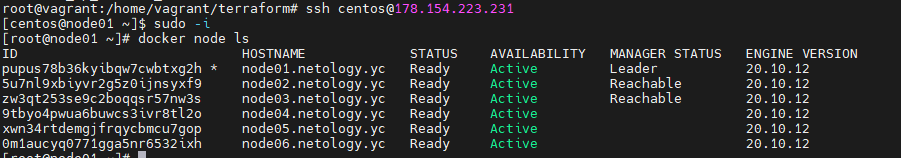
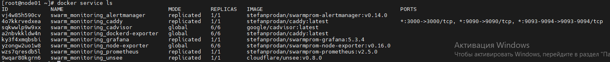

**Задача 1**
Дайте письменые ответы на следующие вопросы:

В чём отличие режимов работы сервисов в Docker Swarm кластере: replication и global?
Какой алгоритм выбора лидера используется в Docker Swarm кластере?
Что такое Overlay Network?

***Ответ***

Режим replication означает, что контейнер будет реплицирован на определенное количество узлов. Global - на каждом узле
будет по 1й реплике.  
Для выбора лидера используется так называемый алгоритм поддержания распределенного консенсуса — Raft. 
Overlay Network это виртуальная сеть для обмена данными между контейнерами docker.

**Задача 2**
Создать ваш первый Docker Swarm кластер в Яндекс.Облаке

Для получения зачета, вам необходимо предоставить скриншот из терминала (консоли), с выводом команды:

docker node ls

***Ответ***

**Задача 3**
Создать ваш первый, готовый к боевой эксплуатации кластер мониторинга, состоящий из стека микросервисов.

Для получения зачета, вам необходимо предоставить скриншот из терминала (консоли), с выводом команды:

docker service ls

***Ответ***

