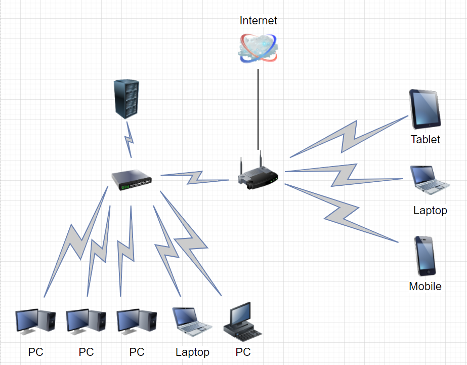

1. Подключитесь к публичному маршрутизатору в интернет. Найдите маршрут к вашему публичному IP
```
telnet route-views.routeviews.org
Username: rviews
show ip route x.x.x.x/32
show bgp x.x.x.x/32
```  
***Ответ***  
```buildoutcfg
route-views>show ip route 46.48.**.**
Routing entry for 46.48.0.0/17
  Known via "bgp 6447", distance 20, metric 0
  Tag 6939, type external
  Last update from 64.71.137.241 7w0d ago
  Routing Descriptor Blocks:
  * 64.71.137.241, from 64.71.137.241, 7w0d ago
      Route metric is 0, traffic share count is 1
      AS Hops 2
      Route tag 6939
      MPLS label: none
      
route-views>show bgp 46.48.**.**
BGP routing table entry for 46.48.0.0/17, version 1085789073
Paths: (24 available, best #19, table default)
  Not advertised to any peer
  Refresh Epoch 1
  4901 6079 8359 12668
    162.250.137.254 from 162.250.137.254 (162.250.137.254)
      Origin IGP, localpref 100, valid, external
      Community: 65000:10100 65000:10300 65000:10400
      path 7FE0AA108680 RPKI State not found
      rx pathid: 0, tx pathid: 0
  Refresh Epoch 3
  ...
  ...
    Refresh Epoch 1
    1351 8359 12668
    132.198.255.253 from 132.198.255.253 (132.198.255.253)
      Origin IGP, localpref 100, valid, external
      path 7FE04B45D7B0 RPKI State not found
      rx pathid: 0, tx pathid: 0
```

2. Создайте dummy0 интерфейс в Ubuntu. Добавьте несколько статических маршрутов. Проверьте таблицу маршрутизации.
***Ответ*** 
```buildoutcfg
root@vagrant:/home/vagrant# ip link add dummy0 type dummy
root@vagrant:/home/vagrant# ip addr show
1: lo: <LOOPBACK,UP,LOWER_UP> mtu 65536 qdisc noqueue state UNKNOWN group default qlen 1000
    link/loopback 00:00:00:00:00:00 brd 00:00:00:00:00:00
    inet 127.0.0.1/8 scope host lo
       valid_lft forever preferred_lft forever
    inet6 ::1/128 scope host
       valid_lft forever preferred_lft forever
2: eth0: <BROADCAST,MULTICAST,UP,LOWER_UP> mtu 1500 qdisc fq_codel state UP group default qlen 1000
    link/ether 08:00:27:73:60:cf brd ff:ff:ff:ff:ff:ff
    inet 10.0.2.15/24 brd 10.0.2.255 scope global dynamic eth0
       valid_lft 79790sec preferred_lft 79790sec
    inet6 fe80::a00:27ff:fe73:60cf/64 scope link
       valid_lft forever preferred_lft forever
3: eth0.10@eth0: <BROADCAST,MULTICAST,SLAVE,UP,LOWER_UP> mtu 1500 qdisc noqueue master bond0 state UP group default qlen 1000
    link/ether 08:00:27:73:60:cf brd ff:ff:ff:ff:ff:ff
4: eth0.20@eth0: <BROADCAST,MULTICAST,SLAVE,UP,LOWER_UP> mtu 1500 qdisc noqueue master bond0 state UP group default qlen 1000
    link/ether 08:00:27:73:60:cf brd ff:ff:ff:ff:ff:ff
5: bond0: <BROADCAST,MULTICAST,MASTER> mtu 1500 qdisc noop state DOWN group default qlen 1000
    link/ether 08:00:27:73:60:cf brd ff:ff:ff:ff:ff:ff
6: dummy0: <BROADCAST,NOARP> mtu 1500 qdisc noop state DOWN group default qlen 1000
    link/ether 1e:7b:07:7b:d5:88 brd ff:ff:ff:ff:ff:ff
root@vagrant:/home/vagrant# route add -net 192.168.2.0/24 gw 10.0.2.15
root@vagrant:/home/vagrant# route add -net 192.168.1.0/24 gw 10.0.2.15
root@vagrant:/home/vagrant# netstat -rn
Kernel IP routing table
Destination     Gateway         Genmask         Flags   MSS Window  irtt Iface
0.0.0.0         10.0.2.2        0.0.0.0         UG        0 0          0 eth0
10.0.2.0        0.0.0.0         255.255.255.0   U         0 0          0 eth0
10.0.2.2        0.0.0.0         255.255.255.255 UH        0 0          0 eth0
192.168.1.0     10.0.2.15       255.255.255.0   UG        0 0          0 eth0
192.168.2.0     10.0.2.15       255.255.255.0   UG        0 0          0 eth0
```

3. Проверьте открытые TCP порты в Ubuntu, какие протоколы и приложения используют эти порты? Приведите несколько примеров.
***Ответ***  
```commandline
root@vagrant:/home/vagrant# ss -ltpn
State  Recv-Q Send-Q   Local Address:Port   Peer Address:Port Process
LISTEN 0      4096           0.0.0.0:111         0.0.0.0:*     users:(("rpcbind",pid=559,fd=4),("systemd",pid=1,fd=35))
LISTEN 0      4096     127.0.0.53%lo:53          0.0.0.0:*     users:(("systemd-resolve",pid=560,fd=13))
LISTEN 0      128            0.0.0.0:22          0.0.0.0:*     users:(("sshd",pid=1333,fd=3))
LISTEN 0      4096              [::]:111            [::]:*     users:(("rpcbind",pid=559,fd=6),("systemd",pid=1,fd=37))
LISTEN 0      128               [::]:22             [::]:*     users:(("sshd",pid=1333,fd=4))
root@vagrant:/home/vagrant# lsof -nP -i | grep LISTEN
systemd       1            root   35u  IPv4  16132      0t0  TCP *:111 (LISTEN)
systemd       1            root   37u  IPv6  16136      0t0  TCP *:111 (LISTEN)
rpcbind     559            _rpc    4u  IPv4  16132      0t0  TCP *:111 (LISTEN)
rpcbind     559            _rpc    6u  IPv6  16136      0t0  TCP *:111 (LISTEN)
systemd-r   560 systemd-resolve   13u  IPv4  19420      0t0  TCP 127.0.0.53:53 (LISTEN)
sshd       1333            root    3u  IPv4  25281      0t0  TCP *:22 (LISTEN)
sshd       1333            root    4u  IPv6  25292      0t0  TCP *:22 (LISTEN)
```
sshd - 22 порт. 111 - systemd

4. Проверьте используемые UDP сокеты в Ubuntu, какие протоколы и приложения используют эти порты?
***Ответ***  
```commandline
root@vagrant:/home/vagrant# lsof -nP -i | grep UDP
systemd       1            root   36u  IPv4  16133      0t0  UDP *:111
systemd       1            root   38u  IPv6  16139      0t0  UDP *:111
systemd-n   400 systemd-network   20u  IPv4  50466      0t0  UDP 10.0.2.15:68
rpcbind     559            _rpc    5u  IPv4  16133      0t0  UDP *:111
rpcbind     559            _rpc    7u  IPv6  16139      0t0  UDP *:111
systemd-r   560 systemd-resolve   12u  IPv4  19419      0t0  UDP 127.0.0.53:53
root@vagrant:/home/vagrant# ss -lupn
State  Recv-Q Send-Q   Local Address:Port   Peer Address:Port Process
UNCONN 0      0        127.0.0.53%lo:53          0.0.0.0:*     users:(("systemd-resolve",pid=560,fd=12))
UNCONN 0      0       10.0.2.15%eth0:68          0.0.0.0:*     users:(("systemd-network",pid=400,fd=20))
UNCONN 0      0              0.0.0.0:111         0.0.0.0:*     users:(("rpcbind",pid=559,fd=5),("systemd",pid=1,fd=36))
UNCONN 0      0                 [::]:111            [::]:*     users:(("rpcbind",pid=559,fd=7),("systemd",pid=1,fd=38))
```
111 systemd, 53 resolver

5. Используя diagrams.net, создайте L3 диаграмму вашей домашней сети или любой другой сети, с которой вы работали.
